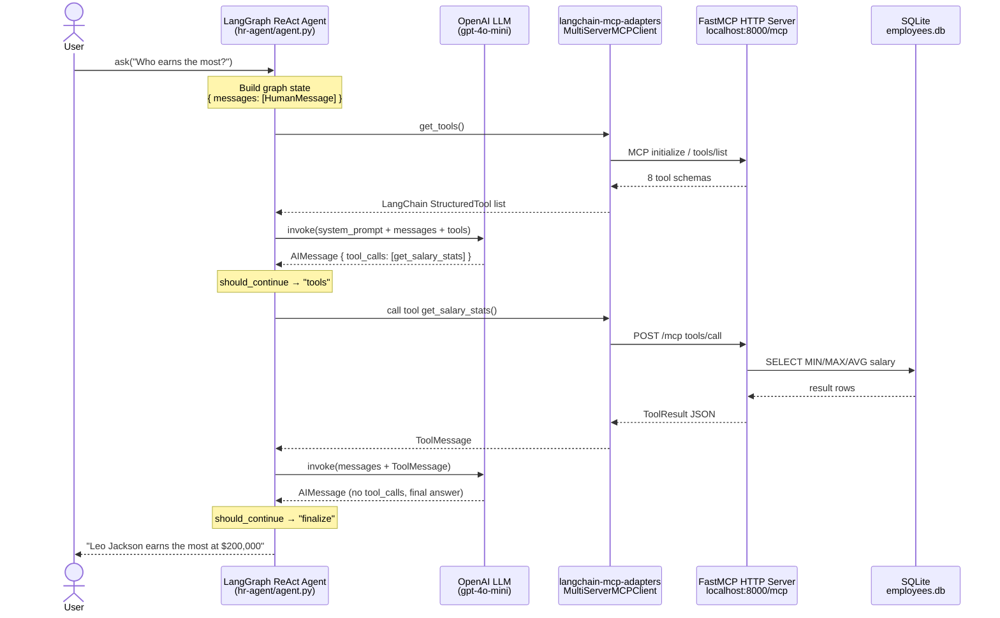
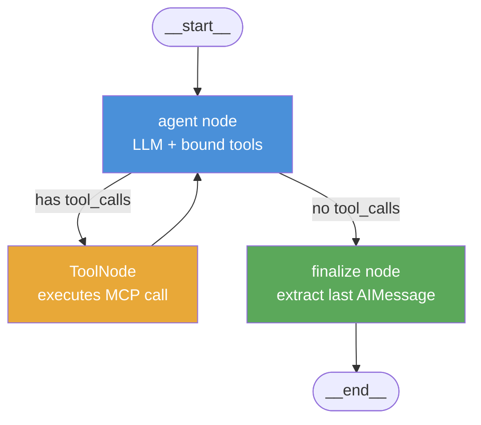

# HR LangGraph Agent

A LangGraph ReAct agent for HR queries, backed by a FastMCP HTTP server that exposes a SQLite employee directory.

---

## Project Structure

```
AgentAI-1Feb2026/
├── employee-mcp/          # FastMCP HTTP server
│   ├── server.py          # MCP server + 8 tools
│   ├── init_db.py         # Seeds SQLite with mock data
│   ├── employees.db       # SQLite database (auto-created)
│   └── requirements.txt
│
└── hr-agent/              # LangGraph HR agent
    ├── agent.py           # ReAct agent wired to MCP tools
    ├── .env               # OPENAI_API_KEY, OPENAI_MODEL
    └── requirements.txt
```

---

## Setup

**1. Install dependencies**

```bash
# MCP server
cd employee-mcp
uv venv --python 3.13 && uv pip install -r requirements.txt

# HR agent
cd ../hr-agent
uv venv --python 3.13 && uv pip install -r requirements.txt
```

**2. Configure environment**

```bash
cp hr-agent/.env.example hr-agent/.env
# edit hr-agent/.env and set OPENAI_API_KEY
```

---

## Running

**Terminal 1 — start the MCP server:**

```bash
cd employee-mcp
.venv/bin/python server.py
# → http://0.0.0.0:8000/mcp
```

**Terminal 2 — run the HR agent:**

```bash
cd hr-agent

# Interactive REPL
.venv/bin/python agent.py

# One-shot question
.venv/bin/python agent.py "Who earns the most in Engineering?"
```

---

## MCP Tools

| Tool | Description |
|---|---|
| `list_employees` | List all employees, filterable by active status |
| `get_employee` | Fetch a single employee by numeric ID |
| `search_employees` | Full-text search on name, email, job title |
| `list_departments` | All departments with headcount |
| `get_employees_by_department` | Employees in a specific department |
| `get_salary_stats` | Min / max / avg salary (global or per dept) |
| `get_schema` | Full database schema — tables, columns, types, PKs |
| `execute_query` | Run a custom read-only SELECT query |

---

## MCP Inspector

The server is compatible with the [MCP Inspector](https://github.com/modelcontextprotocol/inspector).
With the inspector already running at `http://localhost:6274`, connect with:

| Field | Value |
|---|---|
| Transport | `Streamable HTTP` |
| URL | `http://localhost:8000/mcp` |

---

## How the Agent Processes a Request

### Sequence Diagram



### LangGraph State Machine



**Key steps:**

1. `get_tools()` — adapter fetches all 8 tool schemas from MCP at startup
2. **agent node** — LLM decides which tool(s) to call based on the question
3. **tools node** — `ToolNode` dispatches the call through the MCP adapter over HTTP to FastMCP, which queries SQLite
4. Loop back to **agent** until LLM produces a message with no tool calls
5. **finalize** extracts the last `AIMessage` content as the answer

---

## Example Questions

```
Who are the engineers?
What is the average salary in Finance?
Search for Alice
Who earns the most in the company?
Show me the database schema
List all departments and headcount
Use execute_query to find employees hired after 2022
```
